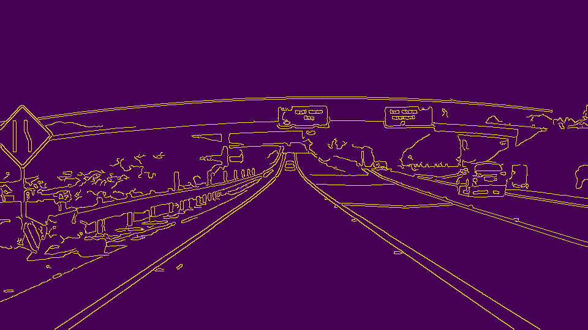

# **Finding Lane Lines on the Road** 

The goals / steps of this project are the following:

In this project, I used Python and OpenCV to find lane lines in the road images.

The following techniques are used:  
Grayscale: Convert regular color image to single channel image.  

  

Gaussian Blur:  Applied to smooth out the noise.  
  

Canny Edge Detection: Transform and detect the edges.  
  

Region masking: Selecting only portion of image defined by polygon vertices rest is blacked out. 

Hough Transform Line Detection: Detects the linear lines in the image  
  

Since some lanes lines are partically recongnized by using extrapolating technique the lines were extended for continuity. 

Identified the left and right lanes with negative and positive slope. And aftering identifiying left and right took the average. 

  

I defined three new helper functions 
def average_slope_intercept(lines): (Gets the left and right slope and intercept based on -ve and +ve slope)
def lane_lines(image, lines): (Gets the coordiantes of x1,y1 and x2,y2)
get_mean_line(line, lines): (Gets the mean line)

# **Reflection**
With the current implementation we observer jitters this could be solved with calculating weighted average of the previous frames output lines.  
Hough transform generates outliers so an outlier reduction approch like RANSAC on the hough lines could be helpful.   
Canny edge detection doesn't perform well on shadows and poor lane marking, alternative edge detections algorithm could be used.
